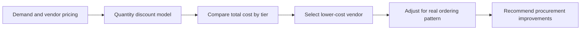

# Inventory Management Case Study

Portfolio project applying inventory and procurement cost analysis to a game-day program and insert ordering decision.

Original academic project associated with Southwestern University.

## Project Focus

The case evaluated how to minimize the cost of producing and distributing game programs and weekly inserts. Two vendors were compared:

- Quality Printing, a local vendor
- First Printing, a lower-price vendor with additional travel cost

The portfolio version focuses on the operations analytics work:

- Comparing vendor price tiers with volume-based discounts
- Applying quantity discount and EOQ-style reasoning
- Separating reusable programs from game-specific inserts
- Recalculating practical order plans for 200,000 programs and 200,000 inserts
- Identifying additional procurement and inventory management improvements

## Method

The analysis used a quantity discount model to compare total costs across pricing tiers. After the model identified First Printing as the lower-cost vendor, the recommendation was refined to account for operational reality: programs could be ordered across multiple batches, while inserts were unique by game and needed separate orders.

## Key Result

First Printing was the lower-cost vendor for both programs and inserts after accounting for the 10% discount and additional travel cost.

The practical ordering plan estimated:

| Cost Component | Selected Vendor | Adjusted Cost |
| --- | --- | ---: |
| Programs | First Printing | $311,025 |
| Inserts | First Printing | $158,325 |
| Total | First Printing | $469,350 |

The analysis also identified operational improvements beyond vendor selection:

- Negotiate a larger volume discount because both products are sourced from the same vendor
- Consolidate trips to reduce travel cost
- Place an annual order commitment to improve pricing leverage
- Explore just-in-time pickup to reduce holding costs

## Project Contents

- [data/vendor_pricing.csv](data/vendor_pricing.csv) - cleaned vendor pricing tiers
- [data/quantity_discount_results.csv](data/quantity_discount_results.csv) - total cost comparison by product, vendor, and volume tier
- [data/adjusted_cost_summary.csv](data/adjusted_cost_summary.csv) - practical ordering recommendation and adjusted costs
- [diagrams/inventory_workflow.mmd](diagrams/inventory_workflow.mmd) - Mermaid workflow diagram
- [docs/project-summary.md](docs/project-summary.md) - concise project context and portfolio notes

## Skills Demonstrated

- Inventory management analysis
- Quantity discount modeling
- EOQ-style cost reasoning
- Vendor cost comparison
- Practical order-plan adjustment
- Procurement strategy recommendations
- Privacy-conscious portfolio curation

## Publishing Note

The original Word document is intentionally excluded from the public portfolio because it includes classroom-report formatting and personal metadata that are not needed for a concise portfolio presentation. This project keeps only the cleaned, derived artifacts needed to explain the work professionally.
