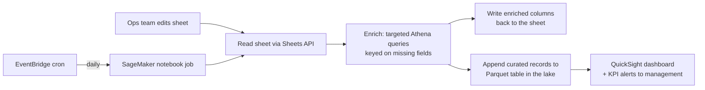

# Google Sheets ⇄ Data Lake: Operational Reverse ETL

Portfolio project turning an operations team's Google Sheet into a governed
citizen of the data platform — enriched from the lake on a schedule, persisted
back to it in Parquet, and reported through QuickSight, with no manual
lookups in between.

Migrated and hardened from production work; all identifiers, buckets, and
query logic shown here are sanitized examples of the real pipeline.

## Problem

The operations team resolved merchant and payor issues daily and tracked that
work where ops teams track everything: a shared Google Sheet. The sheet
accumulated the only record of outreach — but every row needed context
scattered across the data lake (transaction volume, payor details, success
KPIs), so analysts ran the same lookup queries by hand, and none of the
outreach history ever made it back into the lake where management reporting
lives.

## Solution

A scheduled enrichment loop. The sheet stays the ops team's working surface;
the pipeline does everything else:



The original architecture sketch is preserved in
[`diagrams/automation_workflow.png`](diagrams/automation_workflow.png).

## Pipeline stages

1. **Extract** — [`src/sheets_client.py`](src/sheets_client.py) authenticates
   with OAuth 2.0 (cached token, scoped to `spreadsheets`), pulls the working
   range, and normalizes it into a DataFrame with the header row promoted.
2. **Enrich** — [`src/lake_enrichment.py`](src/lake_enrichment.py) finds rows
   with missing context, batches their keys into bounded `IN`-lists, and runs
   targeted Athena queries through PyAthena's `PandasCursor`. Partial results
   merge into one frame keyed on `record_id`.
3. **Write-back** — the enriched columns land back in the sheet
   (clear-then-append against a named range), so the ops team never leaves
   their tool.
4. **Persist** — a one-time bootstrap registers the schema as an external
   table over CSV, then converts it to a Parquet CTAS table
   (SNAPPY-compressed) so the curated dataset stops depending on the seed
   file. Daily runs append new records only —
   [`sql/`](sql/) has the full DDL sequence.
5. **Serve** — QuickSight reads the Parquet table for the management
   dashboard; KPI threshold alerts and a scheduled mail-out replace the
   ad-hoc status requests.
6. **Orchestrate** — an EventBridge (CloudWatch Events) cron triggers the
   SageMaker notebook job daily; failures are logged with full tracebacks.

## Design decisions

- **Parquet CTAS over external CSV table.** The seed CSV bootstraps the
  schema once; converting to Parquet decouples the table from the bucket
  object, cuts Athena scan cost, and makes appends the only write path.
- **Bounded enrichment queries.** Key lists are chunked before interpolation
  into `IN` clauses — Athena query strings have hard size limits, and
  unbounded lists are how daily jobs die on month-end volume.
- **Idempotency by construction.** Bootstrap DDL is `IF NOT EXISTS`; appends
  are keyed on `record_id` + contact date so a rerun cannot double-count an
  outreach.
- **Credential hygiene.** The OAuth client secret and refresh token live
  outside the repo; the token cache is refreshed non-interactively once
  consented. In production this belongs in Secrets Manager — noted as a
  hardening step, not silently claimed.
- **PII boundary.** Merchant and payor data never leave the platform: the
  repo carries query *shapes* and sanitized snippets, not extracts.

## Limitations and next steps

Honest edges of the original build, and what maturing it further looks like:

- Sheet ranges were coordinate-addressed (`K168:Q1368`); named ranges remove
  the silent-breakage risk when ops inserts a column.
- `INSERT INTO` on Hive-style tables should graduate to an Iceberg table with
  `MERGE` semantics for true upsert behavior.
- A notebook on a cron is the right prototype and the wrong endgame; the
  production path is a containerized job on Airflow/MWAA (see my
  [airflow-mwaa-dbt-utilities](https://github.com/dymytryo/airflow-mwaa-dbt-utilities)
  repo for that pattern).

## Repository layout

```text
sheets-to-lake-reverse-etl/
├── README.md
├── diagrams/
│   ├── automation_workflow.png   # original architecture sketch
│   └── pipeline_flow.mmd         # mermaid source for the diagram above
├── sql/
│   ├── 01_bootstrap_external_table.sql
│   ├── 02_parquet_ctas.sql
│   └── 03_incremental_append.sql
└── src/
    ├── sheets_client.py          # OAuth + read/write helpers for Sheets API
    ├── lake_enrichment.py        # batched Athena lookups, merge logic
    └── pipeline.py               # the daily run, end to end
```

**Stack:** Python (pandas, google-api-python-client, PyAthena) · AWS Athena ·
S3 · SageMaker · EventBridge · QuickSight · Presto SQL
